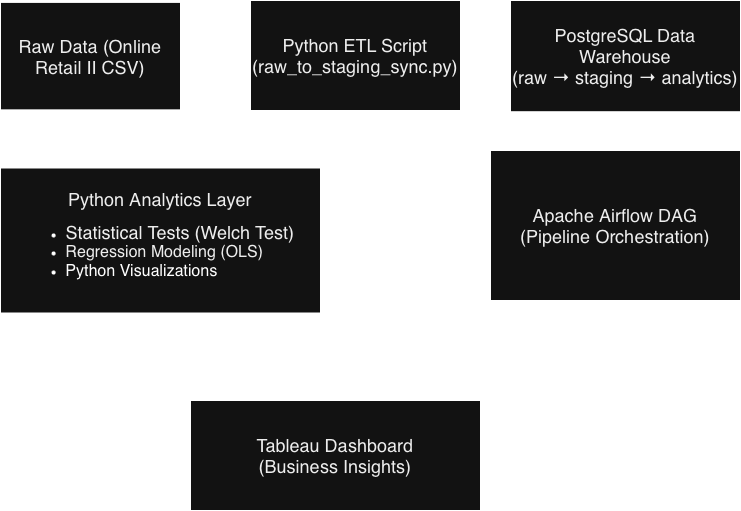
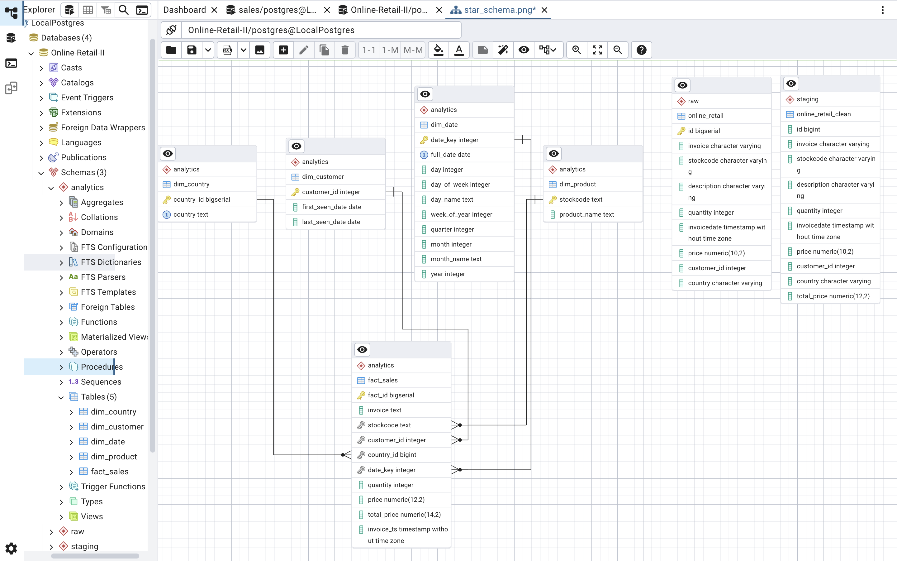
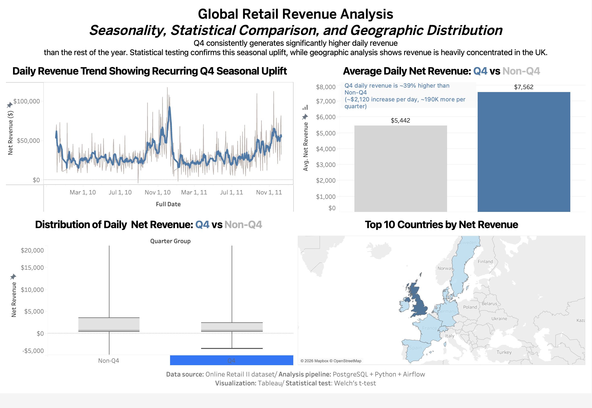
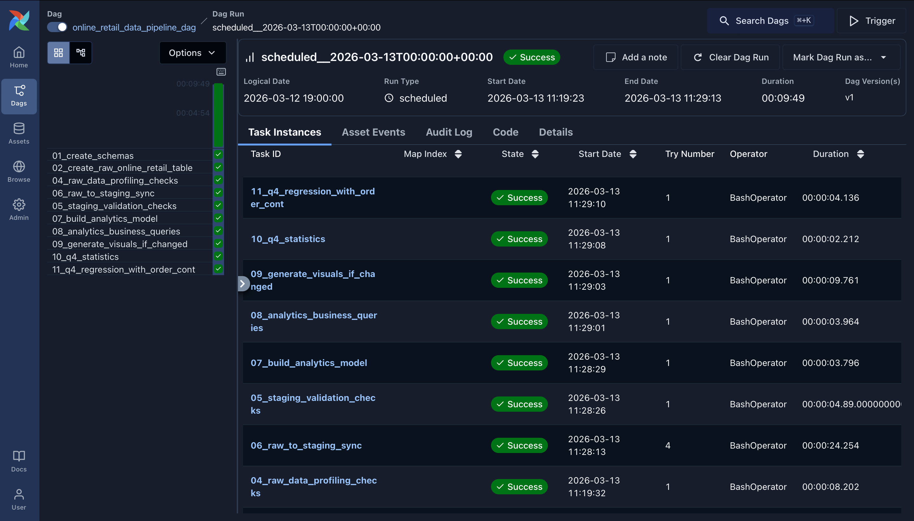

# 🏗️ End-to-End Data Engineering & Analytics Pipeline

**Online Retail II**

Technologies: PostgreSQL • Python • SQL • Apache Airflow • Data Engineering • Analytics • Statistics • Tableau

---

# 📌 Project Overview

This project implements a production-style data engineering and analytics pipeline built using the **Online Retail II transactional dataset**.

The pipeline ingests raw data, applies structured data profiling and validation, incrementally synchronizes data from **Raw → Staging**, builds an analytics-ready star schema, and executes automated analytics workflows including statistical testing, regression modeling, visualization generation, and BI dataset export.

All steps are orchestrated using **Apache Airflow**.

The goal of this project is to design a **reliable, reproducible, and automated analytics system** similar to what is used in real-world data environments.

---

# 🧰 Technology Stack

**Database**

* PostgreSQL

**Processing**

* SQL
* Python

**Libraries**

* Pandas
* NumPy
* Matplotlib

**Orchestration**

* Apache Airflow

**Analytics**

* Welch statistical tests
* OLS regression

**BI Layer**

* Tableau (via exported dataset)

---

# 🧱 Architecture & Data Flow

## Pipeline Architecture



## High-Level Pipeline

```
Raw CSV
    ↓
PostgreSQL (raw schema)
    ↓
Data Profiling & Validation (SQL)
    ↓
Incremental Raw → Staging Sync (Python)
    ↓
Staging Validation
    ↓
Analytics Star Schema
    ↓
Airflow-Orchestrated Analytics
        • Statistical Testing
        • Regression Modeling
        • Python Visualizations
        • Tableau Dataset Export
```

This layered design ensures:

* separation of ingestion and analytics logic
* safe pipeline re-execution
* strong data quality enforcement
* analytics-ready modeling

---

# 🗂️ Project Structure

```
End-to-End-Data-Engineering-Analytics
│
├── airflow
│   ├── dags
│   │   └── online_retail_data_pipeline_dag.py
│   └── logs
│
├── analytics
│   └── outputs
│       ├── figures
│       │   ├── latest
│       │   └── versioned
│       │
│       ├── modeling
│       │   ├── q4_regression_dataset_daily.csv
│       │   └── q4_stats_tests_report.txt
│       │
│       └── tableau
│           ├── Global_Retail_Revenue_Dashboard.twbx
│           └── tableau_daily_kpis.csv
│
├── pipeline_scripts
│   ├── 06_raw_to_staging_sync.py
│   ├── 09_statistics_from_csv_q4_test.py
│   ├── 10_q4_regression_with_order_control.py
│   ├── 11_export_tableau_daily_kpis.py
│   └── generate_visuals.py
│
├── warehouse_sql
│   ├── 01_create_schemas.sql
│   ├── 02_create_raw_online_retail_table.sql
│   ├── 03_load_raw_online_retail.sql
│   ├── 04_raw_data_profiling_checks.sql
│   ├── 05_staging_validation_checks.sql
│   ├── 07_build_analytics_model.sql
│   └── 08_analytics_business_queries.sql
│
├── documentation
│   ├── screenshots
│   │   ├── airflow_dag_success.png
│   │   ├── dashboard_overview.png
│   │   ├── pipeline_architecture.drawio.png
│   │   └── star_schema_ERD.png
│   │
│   ├── Analytics_Findings_and_Business_Insights.pdf
│   ├── Q4_Seasonality_Statistical_Analysis.pdf
│   ├── Raw_Data_Profiling_Summary.pdf
│   └── Tableau_Daily_KPI_Dataset_Export_Explanation.pdf
│
├── README.md
└── .gitignore
```

---

# 🗄️ Analytics Data Model

## Star Schema (Analytics Layer)



The analytics layer is implemented using a **star schema** optimized for reporting.

### Fact Table

* `analytics.fact_sales`

### Dimension Tables

* `analytics.dim_date`
* `analytics.dim_country`
* `analytics.dim_product`
* `analytics.dim_customer`

---

# 🔁 Incremental Raw → Staging Sync

Handled by:

```
pipeline_scripts/06_raw_to_staging_sync.py
```

Key characteristics:

* incremental ingestion
* idempotent execution
* safe re-runs
* no reprocessing of historical data

---

# 🔍 Raw Data Profiling

Before transformation, the dataset was fully profiled.

Key decisions:

* trimmed product descriptions
* preserved missing customer IDs
* kept returns and cancellations
* removed invalid negative prices
* retained zero-value promotional rows

Full documentation:

```
documentation/Raw_Data_Profiling_Summary.pdf
```

---

# 📊 Statistical Testing

Automated Welch tests are used to validate seasonality.

Tests performed:

* Q4 vs non-Q4 revenue
* Q4 vs non-Q4 return rate

Output:

```
analytics/outputs/modeling/q4_stats_tests_report.txt
```

---

# 📉 Regression Modeling

Model:

```
daily_revenue ~ is_q4 + daily_orders
```

Script:

```
pipeline_scripts/10_q4_regression_with_order_control.py
```

Output:

```
analytics/outputs/modeling/q4_regression_dataset_daily.csv
```

---

# 📈 Python-Based Visualization Pipeline

Visualizations are generated programmatically using Python (Pandas + Matplotlib) as part of the Airflow pipeline:

```
pipeline_scripts/generate_visuals.py
```

This is a **data-aware, version-controlled visualization system**.

### How it works

* computes a data signature (row count + latest date)
* skips visualization if data has not changed
* generates new versioned plots when data changes

### Output Structure

```
analytics/outputs/figures
├── _visuals_state.json
│
├── latest
│   ├── daily_revenue_over_time_latest.png
│   ├── monthly_revenue_over_time_latest.png
│   ├── revenue_breakdown_gross_returns_net_latest.png
│   ├── top_countries_by_revenue_latest.png
│   └── top_products_by_revenue_latest.png
│
└── versioned
    ├── daily_revenue_over_time_v1.png
    ├── monthly_revenue_over_time_v1.png
    ├── revenue_breakdown_gross_returns_net_v1.png
    ├── top_countries_by_revenue_v1.png
    └── top_products_by_revenue_v1.png
```

### What this achieves

* avoids duplicate outputs
* supports safe Airflow re-runs
* maintains a full history of outputs
* always exposes a latest view

---

# 📊 Tableau Dataset Export

Script:

```
pipeline_scripts/11_export_tableau_daily_kpis.py
```

Output:

```
analytics/outputs/tableau/tableau_daily_kpis.csv
```

This dataset is designed for direct use in Tableau dashboards.

---

# 📊 Tableau Dashboard



The exported dataset is used to build an interactive Tableau dashboard.

Tableau file:

```
analytics/outputs/tableau/Global_Retail_Revenue_Dashboard.twbx
```

Key highlights:

* Q4 generates ~39% higher daily net revenue than Non-Q4
* - $2,120 increase per day (~$190K more per quarter)
* Distribution analysis confirms uplift is consistent (not driven by outliers)
* Revenue is heavily concentrated in the United Kingdom

---

# ⏱️ Airflow Orchestration

DAG:

```
online_retail_data_pipeline_dag
```

Pipeline tasks:

1. schema creation
2. raw table setup
3. data profiling
4. raw → staging sync
5. staging validation
6. analytics model build
7. business queries
8. visualization generation
9. statistical testing
10. regression modeling

The pipeline is fully automated, idempotent, and safe to re-run.

---

# ✅ Airflow DAG Run Example



---

# 📊 Key Insights

From the analytics layer and statistical modeling:

* Q4 revenue shows a statistically significant increase compared to non-Q4 periods
* Return behavior differs between seasonal and non-seasonal periods
* Daily order volume explains a large portion of revenue variation
* After controlling for order volume, Q4 still contributes additional revenue lift
* A small number of countries and products drive a disproportionate share of total revenue

These findings are validated through both statistical testing and regression modeling.

---

# 📚 Documentation

Additional documentation included:

* data profiling decisions
* statistical analysis
* business insights
* Tableau dataset explanation

Located in:

```
documentation/
```

---

# ⚙️ Repository Scope

Included:

* SQL data warehouse scripts
* Python pipeline scripts
* Airflow DAG
* analytics outputs
* documentation

Excluded:

* credentials (.env)
* virtual environments
* Airflow metadata database
* logs

---

# 🧠 Engineering Practices Demonstrated

* layered data architecture
* incremental pipelines
* idempotent workflows
* automated analytics
* statistical validation
* regression modeling
* version-controlled outputs
* Airflow orchestration

---

# 🚀 Final Notes

The system is built to handle new data safely while maintaining correctness, reproducibility, and analytical integrity.
